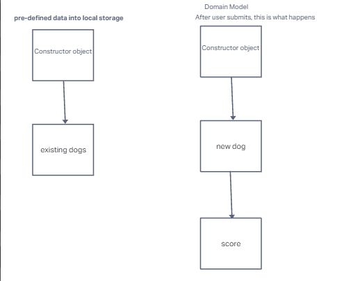

# Welcome to your organization's demo respository
This code repository (or "repo") is designed to demonstrate the best GitHub has to offer with the least amount of noise.

# Bark Buddies

Team NARK

## Authors

Niles
Armando
Rhett
Kaitlin

## Summary

The vision of this app is to help dog lovers find a play date for their dogs by using an easy, efficient app. Many dog owners want to find a play date for their dog but don't know much people in their local area. This app is to fix that problem and help connect dog owners together in their local area.

## Problem Being Solved

It's hard finding dog playdates for my two dogs. One of them is an older Chow Chow with spurts of energy and a calm temperament who doesn't like to roughhouse. The other is a two year old GreyHound Terrier mix. who is a ball of energy who bounces all over the place and loves to roughhouse. This would allow people to find compatible dogs close to them.

### User Stories

- As a working professional, I want to be able to efficiently find other dogs nearby who are compatible with my dog's personality and are at a similar energy-level as my dog.
- As a dog owner, I want a user-friendly web page that allows me to match with local dogs in my area for play dates.
- As a dog owner, I want to be able to find nearby dog parks easily, so that I can take my dog for a fun and engaging playtime experience with similar dogs.
- As a developer, I want to develop a user-friendly interface so that users can find matches for their dogs with no issues.
- As a web designer, I want to develop a easy to use web page that allows users to explore features allowing them to find matches for their dogs.

## MVP

- Data store of fictitious users that have already signed up to match with
- User input form for collecting owner's info and dog'ss info, dropdown menus and check boxes
- Contact method for users to be able to contact owner of matched dog
- Match algorithm that produces match for the user's dog based on criteria (e.g., location, size, activity level)
- Page displaying the match and the location of dog park's nearby

## Wireframe

## Project Management

[Monday work management](https://dewandths-team.monday.com/boards/5486701399/pulses/5495125766)

## Domain Model

## Database Schema Diagram

We are using local storage.
