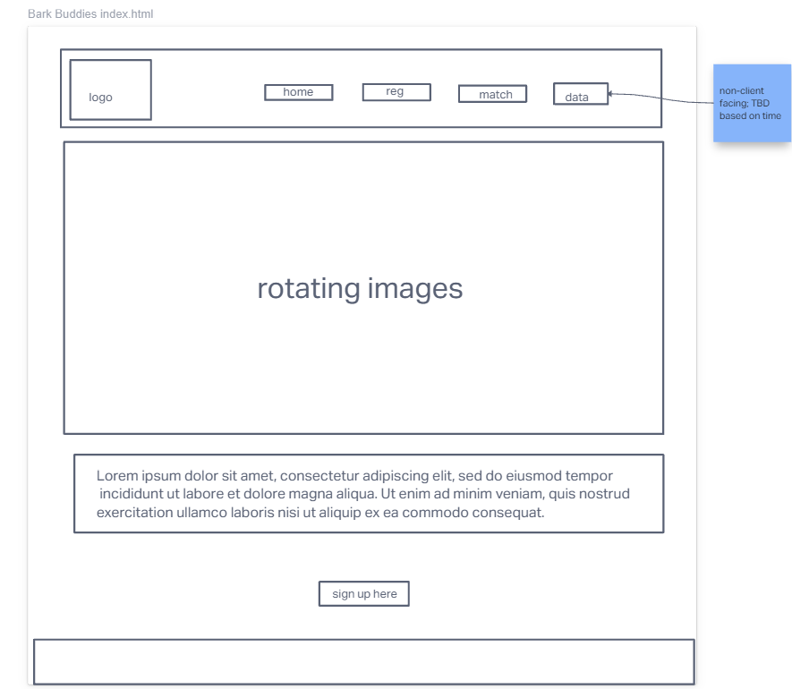
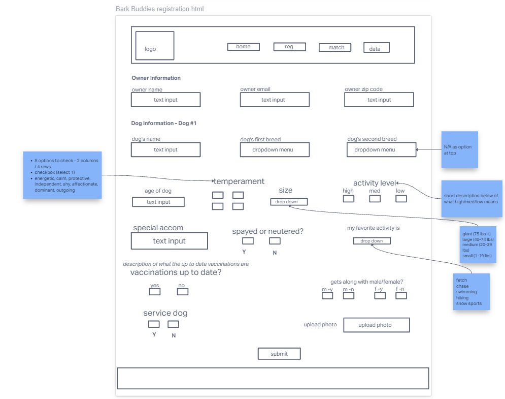
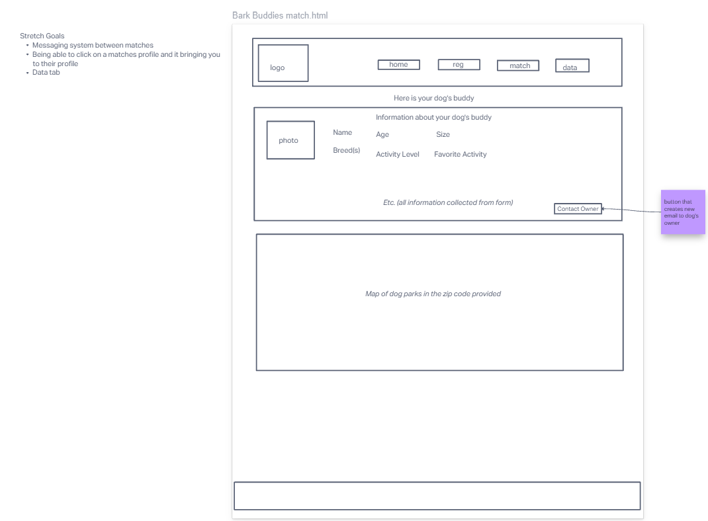

# Welcome to your organization's demo respository
This code repository (or "repo") is designed to demonstrate the best GitHub has to offer with the least amount of noise.

# Bark Buddies

Team NARK

## Authors

Niles
Armando
Rhett
Kaitlin

## Summary

My idea is Bark Buddies, an app where you can put your dog's info and your zip code, and get matched with a similar dog for a playdate at a dog park near you.

## Problem Being Solved

It's hard finding dog playdates for my two dogs. One of them is an older Chow Chow with spurts of energy and a calm temperament who doesn't like to roughhouse. The other is a two year old GreyHound Terrier mix. who is a ball of energy who bounces all over the place and loves to roughhouse. This would allow people to find compatible dogs close to them. While also making them aware of the dog parks in their area.

## MVP

Images of dogs, table of fictitious users that have already signed up to match with, google maps API, user input form for dogs info, dropdown menus and check boxes, contact method for users.

## Wireframe

