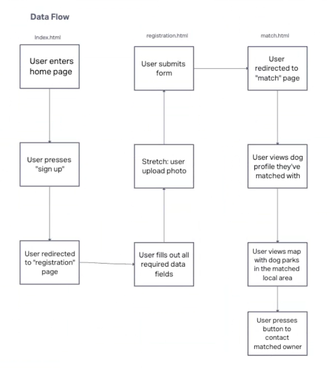

# Software Requirements

## Vision

The vision of this app is to help dog lovers find a play date for their dogs by using an easy, efficient app. Many dog owners want to find a play date for their dog but don't know much people in their local area. This app is to fix that problem and help connect dog owners together in their local area. This app solves your problems of findng a play date for your dogs.

## Scope

### In Scope

This product will collect user information and match dog owners with other dog owners in their local area (zip code).
We will have a form where users input their information about themselves and their dog. The information we will collect from the user is their name, city, state, zip code, and email. We will collect information about the users dog, which will be the dogs name, breed, age, temperment, size, activity level, special accomodations, spayed or neutered, favroite activity, up-to-date vaccinations, service dog, and whether they get along with males/females. There will also be a section where the user can upload a photo of your dog. This website will show appropriate dog matches after entering the user information, along with a map that shows dog parks that are located between the user and their dog matches.

### Out of Scope

This website will not use an API to load map data. It will also not have built-in messaging, we will have users contact each other through email instead.

OUT - What will your product not do.
These should be features that you will make very clear from the beginning that you will not do during development. These should be limited and very few. Pick your battles wisely. This should only be 1 or 2 things. Example: My website will never turn into an IOS or Android app.

### Minimum Viable Product Functionality

- Data store of fictitious users that have already signed up to match with
- User input form for collecting owner's info and dog'ss info, dropdown menus and check boxes
- Contact method for users to be able to contact owner of matched dog
- Map display of dog parks in the matched users' area
- Match algorithm that produces match for the user's dog based on criteria (e.g., location, size, activity level)
- Page displaying the match and the location of dog park's nearby

### Stretch Goals

- Create a working messaging system between matches
- Being able to click on a matches profile and having it bring you to their profile
- Photo upload by user of their dog's photo
- Adding images of user's submitted dog photo to their profile
- Google maps API
- Message functionality in app

## Functional Requirements

1. A user can enter location / dog data which will match them to a compatible individual and their dog
2. A user will be able to contact their match in order to set up play date

## Data Flow

